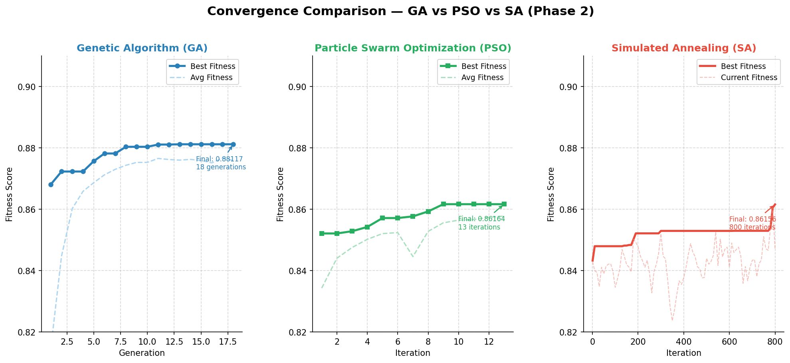
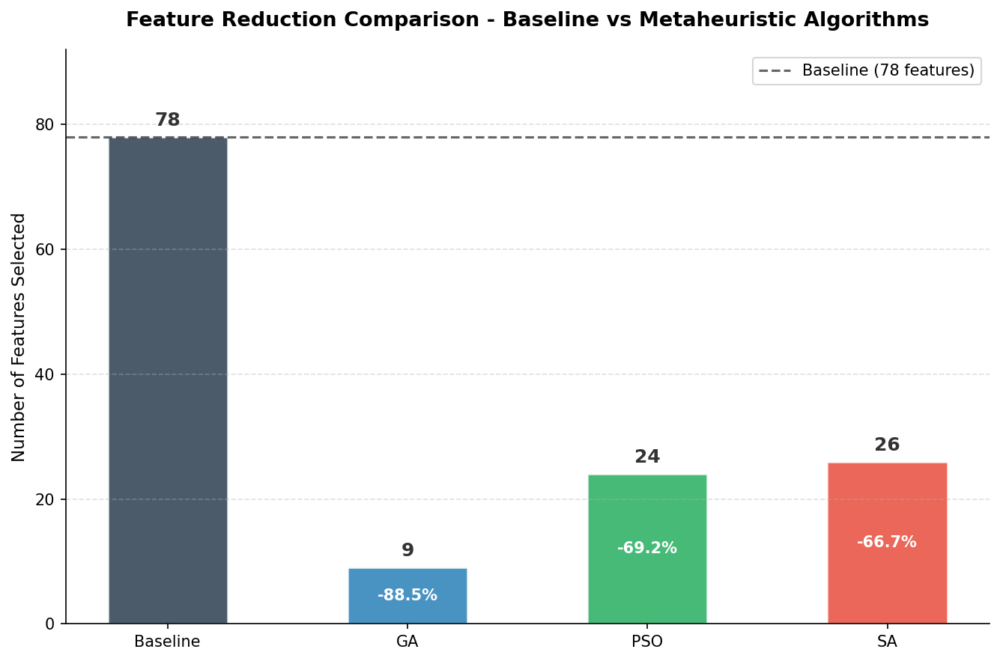
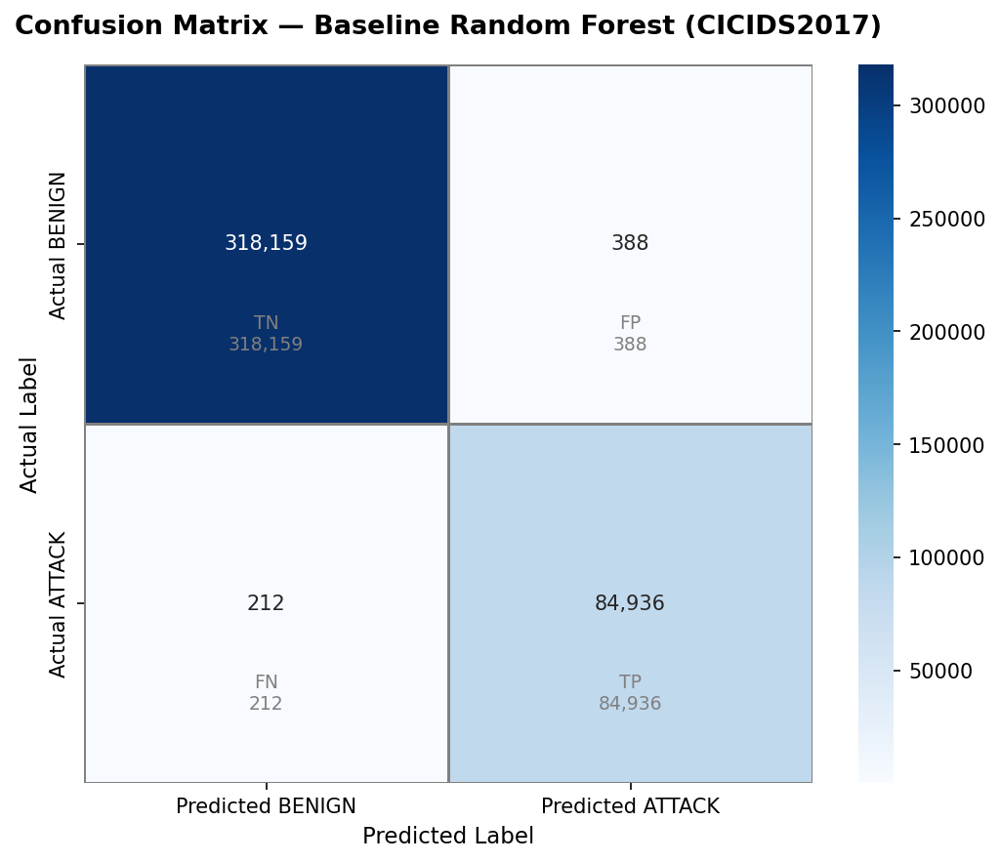
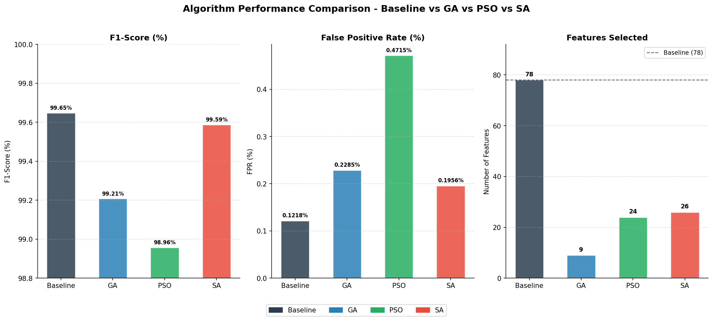

# ⚡ Distributed Metaheuristic Optimization Framework
### AI-Based Intrusion Detection System (CICIDS2017) Using Metaheuristic Feature Selection

An algorithmic optimization and empirical evaluation suite designed for high-dimensional feature selection and hyperparameter tuning in Network Intrusion Detection Systems (NIDS). The framework benchmarks **Genetic Algorithms (GA)**, **Particle Swarm Optimization (PSO)**, and **Simulated Annealing (SA)** over the **CICIDS2017** benchmark dataset (800,000+ balanced network flow records across 78 features) to eliminate feature redundancy and maximize intrusion classification metrics.

---

## 📊 Empirical Convergence & Benchmark Showcase

| Algorithmic Convergence Trajectories | Feature Space Reduction Efficiency |
| :---: | :---: |
|  |  |
| *Multi-agent fitness log convergence across generations* | *Dimensionality reduction vs. predictive performance trade-off* |

| Confusion Matrix (Optimal Ensemble) | Multi-Metric Benchmark Comparison |
| :---: | :---: |
|  |  |
| *Network attack classification resolution (Random Forest)* | *Macro-F1, Precision, Recall, and Accuracy comparisons* |

---

## 🔬 Core Metaheuristic Engines & Architecture

* **Simulated Annealing (SA) Engine (`sa_optimization.py`):**
  * Implemented stochastic thermodynamic cooling schedules ($T_{k+1} = \alpha T_k$) governed by the Metropolis acceptance criterion.
  * Single-bit perturbation strategy for localized neighborhood exploration over binary feature masks.
  * Evaluated across ~276 minutes of compute runtime to isolate global optima without premature convergence.
* **Particle Swarm Optimization (PSO) Engine (`pso_optimization.py`):**
  * Continuous-to-discrete sigmoid velocity mapping across high-dimensional boolean search spaces.
  * Dynamically adjusted inertia weights ($w$) balancing broad exploration and localized exploitation (~67 min runtime).
* **Genetic Algorithm (GA) Engine (`ga_optimization.py`):**
  * Binary chromosome encoding with roulette-wheel selection, two-point crossover, and bit-flip mutation (~53 min runtime).
* **Data Processing & Balancing Pipeline (`data_prep.py`):**
  * Automated cleaning and normalization (Min-Max Scaling) across 7 network traffic subsets of CICIDS2017.
  * Resolved extreme multi-class class imbalance via Synthetic Minority Over-sampling Technique (**SMOTE**), capping at 400,000 stratified training records.

---

## 📁 Repository Structure

```text
├── docs/                             # Visualizations, convergence curves & benchmark plots
│   ├── confusion_matrix.png
│   ├── feature_importance.png
│   ├── feature_reduction_comparison.png
│   ├── group_convergence_comparison.png
│   └── metrics_comparison.png
├── ga_best_solution.json             # Optimal chromosome mask & hyperparams (GA)
├── ga_fitness_log.csv                # Per-generation fitness tracking (GA)
├── pso_best_solution.json            # Optimal global best position & metrics (PSO)
├── pso_fitness_log.csv               # Velocity & convergence tracking (PSO)
├── sa_best_solution.json             # Optimal annealing solution state (SA)
├── sa_fitness_log.csv                # Temperature & acceptance trajectory (SA)
├── baseline_model.py                 # Evaluates unoptimized 78-feature Random Forest
├── data_prep.py                      # Preprocessing, Min-Max scaling & SMOTE balancing
├── ga_optimization.py                # Genetic Algorithm optimization engine
├── pso_optimization.py               # Particle Swarm Optimization engine
├── sa_optimization.py                # Simulated Annealing optimization engine
├── visualizations.py                 # Plotting suite for metrics, ROC & convergence logs
└── README.md                         # Technical documentation & project portfolio
```

---

## 🛠️ Tech Stack & Dependencies

* **Language:** Python 3.8+ (Tested on Python 3.12)
* **Core Machine Learning:** `scikit-learn`, `imbalanced-learn` (SMOTE), Random Forest
* **Data Science & Analytics:** `pandas`, `numpy`
* **Plotting & Analytics Suite:** `matplotlib`, `seaborn`

---

## 🚀 Quick Start & Reproducibility

### 1. Clone the Repository
```bash
git clone https://github.com/Mohammed-Senan/distributed-metaheuristic-optimization-framework.git
cd distributed-metaheuristic-optimization-framework
```

### 2. Environment Setup
```bash
# Create and activate virtual environment (optional)
py -m venv venv
venv\Scripts\activate

# Install core dependencies
py -m pip install pandas scikit-learn numpy imbalanced-learn matplotlib seaborn
```

### 3. Execution Pipeline

> **Note on Pre-Computed Results:** The optimization engines require extensive compute time (~6.5 hours combined). Pre-computed convergence histories (`*_fitness_log.csv`) and optimal configurations (`*_best_solution.json`) are committed to this repository for immediate inspection and reproduction.

```bash
# Step 1: Preprocess raw CICIDS2017 CSVs (Skip if pre-processed CSVs exist)
py data_prep.py

# Step 2: Train baseline Random Forest (All 78 features)
py baseline_model.py

# Step 3: Run Metaheuristic Optimizers (Optional - Pre-computed results included)
py ga_optimization.py     # ~53 min
py pso_optimization.py    # ~67 min
py sa_optimization.py     # ~276 min

# Step 4: Re-generate evaluation plots & confusion matrices
py visualizations.py
```

---
